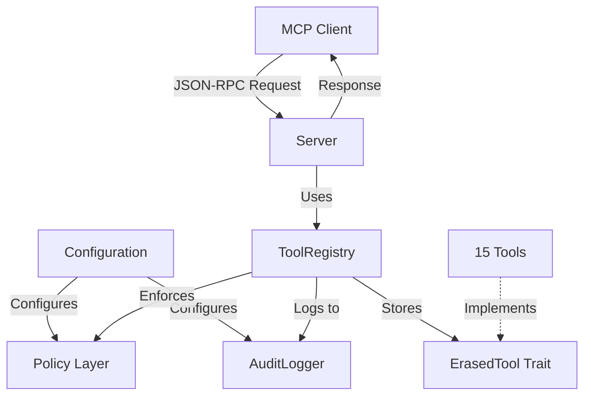
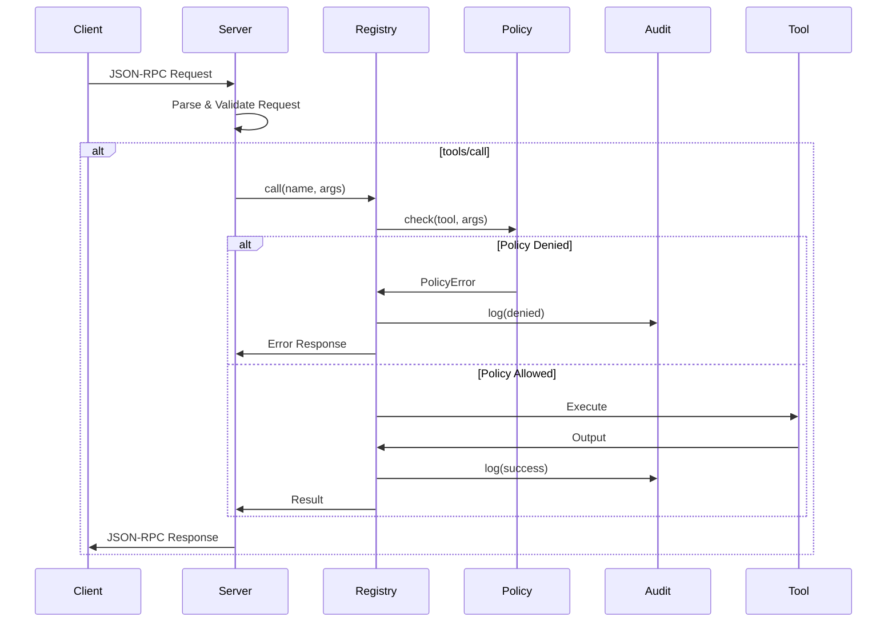

# MCP-RS Developer Documentation

This documentation provides in-depth technical details about the MCP-RS architecture, practical examples, and advanced usage patterns. For basic setup and configuration, see the [root README](../../README.md).

## Table of Contents

1. [Architecture Overview](#architecture-overview)
2. [Core Concepts](#core-concepts)
3. [Configuration](#configuration)
4. [Policy and Security](#policy-and-security)
5. [Audit Logging](#audit-logging)
6. [Tool Reference](#tool-reference)
7. [Practical Examples](#practical-examples)
8. [API Reference](#api-reference)
9. [Usage Patterns](#usage-patterns)
10. [Advanced Topics](#advanced-topics)
11. [Troubleshooting](#troubleshooting)

---

## Architecture Overview

MCP-RS is a production-ready MCP server that acts as a **Command Firewall** between AI clients and system capabilities. It provides:

- **Type-safe tool execution** with compile-time guarantees
- **Policy-based authorization** for access control
- **Structured audit logging** for compliance and debugging
- **Configurable behavior** via TOML configuration

### Component Relationships



### Request Flow with Policy and Audit



### Type System Flow

The architecture uses Rust's trait system combined with type erasure to achieve both type safety and dynamic dispatch:


**Key Insight**: Each tool is statically typed with its own `Input` and `Output` types, but the registry stores them as `Box<dyn ErasedTool>`, enabling heterogeneous storage while maintaining type safety at execution time.

---

## Core Concepts

### The Tool Trait

The `Tool` trait is the foundation of MCP-RS. It defines the contract that all tools must implement:

```rust
pub trait Tool {
    const NAME: &'static str;
    const DESCRIPTION: &'static str;

    type Input: for<'de> Deserialize<'de>;
    type Output: Serialize;

    fn run(&self, input: Self::Input) -> Self::Output;
    fn schema() -> Value;
}
```

**Key Components**:

- `NAME`: Unique identifier for the tool (used in `tools/call` requests)
- `DESCRIPTION`: Human-readable description shown in tool listings
- `Input`: Associated type defining the input structure (must be deserializable)
- `Output`: Associated type defining the output structure (must be serializable)
- `run()`: Core logic that transforms input to output
- `schema()`: JSON Schema describing the input format (used by MCP clients)

### Structured Error Handling

MCP-RS uses `thiserror` for structured error handling:

```rust
#[derive(Debug, thiserror::Error)]
pub enum McpError {
    #[error("Tool not found: {0}")]
    ToolNotFound(String),
    
    #[error("Policy denied access: {0}")]
    PolicyDenied(String),
    
    #[error("Invalid arguments: {0}")]
    InvalidArguments(String),
    
    #[error("Tool execution failed: {0}")]
    ExecutionError(String),
    
    #[error("Serialization error: {0}")]
    SerializationError(String),
}
```

Each error type maps to appropriate JSON-RPC error codes for client compatibility.

### JSON-RPC Protocol

MCP-RS implements JSON-RPC 2.0 with MCP-specific methods:

**Supported Methods**:
- `initialize`: Handshake and capability negotiation
- `initialized`: Notification (no response)
- `tools/list`: List all available tools
- `tools/call`: Execute a specific tool

**Error Codes**:
- `-32700`: Parse error
- `-32600`: Invalid request
- `-32601`: Method not found
- `-32602`: Invalid params (includes policy denials)
- `-32603`: Internal error

---

## Configuration

MCP-RS is configured via a TOML file (`mcp-rs.toml`). If no configuration file exists, sensible defaults are used.

### Configuration File Structure

```toml
# mcp-rs.toml

[server]
name = "mcp-rs"
version = "0.1.0"

[logging]
level = "info"           # trace, debug, info, warn, error
format = "compact"       # compact, pretty, json
include_source = false   # Include file/line in logs

[policy]
mode = "default"         # default, restrictive, permissive
allowed_paths = [".", "/tmp", "/var/tmp"]
denied_paths = ["/etc", "/System", "/usr/bin"]
max_file_size_mb = 10
allowed_commands = ["cargo", "rustc", "git"]
allow_env_access = true
allow_cargo_operations = true

[audit]
enabled = true
log_path = "./mcp-audit.jsonl"
log_successes = true
log_policy_denials = true
log_errors = true
max_file_size_mb = 100
pretty_print = false
```

### Configuration Loading

Configuration is loaded from these locations (in order):

1. `./mcp-rs.toml` (current directory)
2. `~/.config/mcp-rs/config.toml` (user config)
3. Default values if no file found

### Environment Variable Override

Set the log level via environment:

```bash
RUST_LOG=debug ./target/release/mcp-rs
```

---

## Policy and Security

MCP-RS implements a **Command Firewall** pattern where all AI tool calls are validated against a configurable policy before execution.

### Policy Modes

**Default Mode**: Balanced security with common directories allowed
```toml
[policy]
mode = "default"
allowed_paths = [".", "/tmp", "/var/tmp"]
denied_paths = ["/etc", "/System"]
```

**Restrictive Mode**: Minimal access, current directory only
```toml
[policy]
mode = "restrictive"
allowed_paths = ["."]
```

**Permissive Mode**: Development/testing only
```toml
[policy]
mode = "permissive"
allowed_paths = ["/"]
```

### Policy Checks

The policy layer validates:

1. **Path Access**: File operations are checked against allowed/denied paths
2. **Path Traversal**: `../` sequences are detected and blocked
3. **File Size**: Large files are rejected to prevent memory issues
4. **Command Execution**: Only allowlisted commands can be inspected
5. **Environment Access**: Can be globally enabled/disabled
6. **Cargo Operations**: Build/test/check can be controlled

### Policy Enforcement Example

```rust
// In registry.rs
pub fn call(&self, name: &str, args: Value) -> McpResult<Value> {
    // Policy check happens before tool execution
    self.policy.check(name, &args)?;
    
    // Only executes if policy allows
    self.execute_tool(name, args)
}
```

### Security Best Practices

1. **Use restrictive mode in production**: Start with minimal access, expand as needed
2. **Audit denied requests**: Review audit logs for policy denials
3. **Validate paths**: All file tools canonicalize and validate paths
4. **Limit file sizes**: Prevent memory exhaustion with size limits
5. **Allowlist commands**: Only permit known-safe commands

---

## Audit Logging

MCP-RS provides comprehensive audit logging for compliance, debugging, and security analysis.

### Audit Log Format

Logs are written in JSON Lines format (one JSON object per line):

```json
{"timestamp":"2024-01-15T10:30:00Z","request_id":1,"tool_name":"read_file","arguments":{"path":"Cargo.toml"},"result":"Success","duration_ms":5}
{"timestamp":"2024-01-15T10:30:01Z","request_id":2,"tool_name":"read_file","arguments":{"path":"/etc/passwd"},"result":"PolicyDenied","policy_checks":["path_denied"],"duration_ms":0}
```

### Audit Entry Structure

```rust
pub struct AuditEntry {
    pub timestamp: String,
    pub request_id: Value,
    pub tool_name: String,
    pub arguments: Value,
    pub result: AuditResult,
    pub duration_ms: u64,
    pub policy_checks: Vec<String>,
}

pub enum AuditResult {
    Success,
    PolicyDenied,
    Error(String),
}
```

### Session Replay

Audit logs can be replayed for debugging:

```rust
use audit::SessionReplay;

let replay = SessionReplay::new("./mcp-audit.jsonl")?;
let entries = replay.get_all_entries();

// Filter by tool
let file_reads = replay.filter_by_tool("read_file");

// Filter by result
let denials = replay.filter_by_result(AuditResult::PolicyDenied);
```

---

## Tool Reference

MCP-RS includes 15 built-in tools organized by category:

### File Access Tools

| Tool | Description |
|------|-------------|
| `read_file` | Read file contents with optional line range |
| `list_directory` | List directory contents with optional recursion |
| `file_stats` | Get file/directory statistics (size, timestamps, permissions) |
| `find_files` | Find files by glob pattern |
| `read_toml` | Parse and query TOML files |

### Search Tools

| Tool | Description |
|------|-------------|
| `grep_file` | Search within a single file |
| `grep_project` | Search across multiple files with glob filtering |

### Cargo/Build Tools

| Tool | Description |
|------|-------------|
| `cargo_check` | Run cargo check with structured diagnostics |
| `cargo_build` | Run cargo build with artifact tracking |
| `cargo_test` | Run cargo test with result parsing |

### System Tools

| Tool | Description |
|------|-------------|
| `system_info` | Get OS, architecture, Rust versions, CWD |
| `read_env` | Read environment variables (with sensitive data masking) |
| `check_command` | Check if a command exists and get its version |

### Utility Tools

| Tool | Description |
|------|-------------|
| `say_hello` | Simple greeting tool (example) |
| `health` | Server health check with uptime and statistics |

### Tool Output Patterns

All tools follow consistent output patterns:

**Success with data**:
```json
{
  "success": true,
  "content": "file contents...",
  "line_count": 42
}
```

**Error response**:
```json
{
  "success": false,
  "error": "File not found: /path/to/file"
}
```

**Structured results** (cargo tools):
```json
{
  "success": true,
  "errors": [],
  "warnings": [{"message": "...", "file": "...", "line": 10}],
  "error_count": 0,
  "warning_count": 1
}
```

---

## Practical Examples

### Example 1: Simple Greeting Tool (Hello)

Let's walk through the built-in `Hello` tool step by step.

**1. Define Input/Output Structures**

```rust
#[derive(Deserialize)]
pub struct Input {
    pub name: String,
}

#[derive(Serialize)]
pub struct Output {
    pub message: String,
}
```

**2. Create the Tool Struct**

```rust
pub struct Hello;
```

No state needed for this tool, so we use a unit-like struct.

**3. Implement the Tool Trait**

```rust
impl Tool for Hello {
    const NAME: &'static str = "say_hello";
    const DESCRIPTION: &'static str = "Say hello from typed Rust";

    type Input = Input;
    type Output = Output;

    fn run(&self, input: Input) -> Output {
        Output {
            message: format!("Hello, {}! 🦀", input.name),
        }
    }

    fn schema() -> serde_json::Value {
        json!({
            "type": "object",
            "properties": {
                "name": { "type": "string" }
            },
            "required": ["name"]
        })
    }
}
```

**4. Register the Tool**

```rust
// In main.rs
let mut registry = ToolRegistry::new_with_audit(policy, audit_logger);
registry.register(Hello);
```

**Testing**:

```bash
echo '{"jsonrpc":"2.0","id":1,"method":"tools/call","params":{"name":"say_hello","arguments":{"name":"World"}}}' | cargo run --release
```

### Example 2: File Reader with Policy

A practical tool demonstrating policy integration:

```rust
use crate::tool::Tool;
use serde::{Deserialize, Serialize};
use serde_json::json;
use std::fs;
use std::path::Path;

pub struct ReadFile;

#[derive(Deserialize)]
pub struct Input {
    pub path: String,
    #[serde(default)]
    pub start_line: Option<u32>,
    #[serde(default)]
    pub end_line: Option<u32>,
}

#[derive(Serialize)]
pub struct Output {
    pub success: bool,
    #[serde(skip_serializing_if = "Option::is_none")]
    pub content: Option<String>,
    #[serde(skip_serializing_if = "Option::is_none")]
    pub line_count: Option<u32>,
    #[serde(skip_serializing_if = "Option::is_none")]
    pub error: Option<String>,
}

impl Tool for ReadFile {
    const NAME: &'static str = "read_file";
    const DESCRIPTION: &'static str = "Read file contents with optional line range";

    type Input = Input;
    type Output = Output;

    fn run(&self, input: Input) -> Output {
        let path = Path::new(&input.path);

        // Validation happens in run() for tool-specific checks
        // Policy checks happen in registry before run() is called
        
        if !path.exists() {
            return Output {
                success: false,
                content: None,
                line_count: None,
                error: Some(format!("File not found: {}", input.path)),
            };
        }

        match fs::read_to_string(path) {
            Ok(content) => {
                let lines: Vec<&str> = content.lines().collect();
                let total_lines = lines.len() as u32;
                
                Output {
                    success: true,
                    content: Some(content),
                    line_count: Some(total_lines),
                    error: None,
                }
            }
            Err(e) => Output {
                success: false,
                content: None,
                line_count: None,
                error: Some(format!("Failed to read file: {}", e)),
            },
        }
    }

    fn schema() -> serde_json::Value {
        json!({
            "type": "object",
            "properties": {
                "path": {
                    "type": "string",
                    "description": "Path to the file to read"
                },
                "start_line": {
                    "type": "integer",
                    "description": "Starting line number (1-indexed)",
                    "minimum": 1
                },
                "end_line": {
                    "type": "integer",
                    "description": "Ending line number (1-indexed)",
                    "minimum": 1
                }
            },
            "required": ["path"]
        })
    }
}
```

### Example 3: Health Check Tool

The health tool provides server introspection:

```rust
pub struct Health;

#[derive(Deserialize)]
pub struct Input {
    #[serde(default)]
    pub include_details: bool,
}

#[derive(Serialize)]
pub struct Output {
    pub status: String,          // "healthy", "degraded", "unhealthy"
    pub uptime_seconds: u64,
    pub tools_registered: u32,
    pub requests_processed: u64,
    pub timestamp: String,
    #[serde(skip_serializing_if = "Option::is_none")]
    pub policy_version: Option<String>,
}
```

**Usage**:

```bash
echo '{"jsonrpc":"2.0","id":1,"method":"tools/call","params":{"name":"health","arguments":{"include_details":true}}}' | cargo run --release
```

---

## API Reference

### Server API

**`Server::new(tools: ToolRegistry) -> Self`**

Creates a new MCP server instance with the given tool registry.

```rust
let registry = ToolRegistry::new_with_audit(policy, audit_logger);
let server = Server::new(registry);
```

**`server.run()`**

Starts the server event loop, reading from stdin and writing to stdout.

```rust
server.run(); // Blocks until stdin closes
```

### ToolRegistry API

**`ToolRegistry::new() -> Self`**

Creates an empty tool registry with default policy.

**`ToolRegistry::new_with_audit(policy: Policy, audit_logger: AuditLogger) -> Self`**

Creates a registry with custom policy and audit logging.

```rust
let policy = config.to_policy();
let audit_logger = AuditLogger::new(config.to_audit_config())?;
let mut registry = ToolRegistry::new_with_audit(policy, audit_logger);
```

**`registry.register<T: Tool + 'static>(tool: T)`**

Registers a tool instance in the registry.

```rust
registry.register(Hello);
registry.register(ReadFile);
```

**`registry.call(name: &str, args: Value) -> McpResult<Value>`**

Executes a tool by name with policy enforcement and audit logging.

```rust
match registry.call("read_file", json!({"path": "Cargo.toml"})) {
    Ok(result) => println!("Success: {}", result),
    Err(McpError::PolicyDenied(msg)) => eprintln!("Denied: {}", msg),
    Err(e) => eprintln!("Error: {}", e),
}
```

### Policy API

**`Policy::default() -> Self`**

Creates a policy with sensible defaults.

**`Policy::restrictive() -> Self`**

Creates a minimal-access policy.

**`policy.check(tool: &str, args: &Value) -> McpResult<()>`**

Validates a tool call against the policy.

### AuditLogger API

**`AuditLogger::new(config: AuditConfig) -> McpResult<Self>`**

Creates an audit logger with the given configuration.

**`AuditLogger::disabled() -> Self`**

Creates a no-op audit logger.

**`logger.log(entry: &AuditEntry) -> McpResult<()>`**

Writes an audit entry to the log file.

---

## Usage Patterns

### Basic Server Setup

Minimal example with default configuration:

```rust
mod audit;
mod config;
mod error;
mod policy;
mod protocol;
mod registry;
mod server;
mod tool;
mod tools { pub mod hello; }

use audit::AuditLogger;
use registry::ToolRegistry;
use server::Server;
use tools::hello::Hello;

fn main() {
    let config = config::load_config();
    let policy = config.to_policy();
    let audit_logger = AuditLogger::new(config.to_audit_config())
        .unwrap_or_else(|_| AuditLogger::disabled());
    
    let mut registry = ToolRegistry::new_with_audit(policy, audit_logger);
    registry.register(Hello);
    
    let server = Server::new(registry);
    server.run();
}
```

### Testing Tools

**Unit Testing**:

```rust
#[cfg(test)]
mod tests {
    use super::*;

    #[test]
    fn test_read_file_success() {
        let tool = ReadFile;
        let input = Input {
            path: "Cargo.toml".to_string(),
            start_line: None,
            end_line: None,
        };
        
        let output = tool.run(input);
        assert!(output.success);
        assert!(output.content.is_some());
    }

    #[test]
    fn test_read_file_not_found() {
        let tool = ReadFile;
        let input = Input {
            path: "/nonexistent/file.txt".to_string(),
            start_line: None,
            end_line: None,
        };
        
        let output = tool.run(input);
        assert!(!output.success);
        assert!(output.error.is_some());
    }
}
```

**Integration Testing**:

Use the provided `test_all_tools.sh` script:

```bash
./test_all_tools.sh
```

This runs 50+ integration tests covering all tools and edge cases.

---

## Advanced Topics

### Structured Logging with Tracing

MCP-RS uses the `tracing` crate for structured logging:

```rust
use tracing::{info, warn, error, debug, instrument};

#[instrument(skip(self))]
fn process_request(&self, request: &Request) {
    info!(method = %request.method, "Processing request");
    
    if let Err(e) = self.validate(request) {
        warn!(error = %e, "Validation failed");
    }
}
```

**Log Levels**:
- `trace`: Very verbose, per-request details
- `debug`: Debugging information
- `info`: Normal operation events
- `warn`: Potential issues
- `error`: Errors that need attention

### Custom Error Types

Enhance error handling using the error module:

```rust
use crate::error::{McpError, McpResult};

fn my_operation() -> McpResult<String> {
    // Use ? operator with McpError
    let data = read_data()
        .map_err(|e| McpError::ExecutionError(e.to_string()))?;
    
    Ok(data)
}
```

### Performance Tips

**1. Use Release Builds**:
```bash
cargo build --release
```
Release builds are 10-100x faster than debug builds.

**2. Profile Your Tools**:
```bash
cargo install flamegraph
cargo flamegraph --bin mcp-rs
```

**3. Monitor with Health Tool**:
```bash
# Check server health and statistics
echo '{"jsonrpc":"2.0","id":1,"method":"tools/call","params":{"name":"health","arguments":{}}}' | ./target/release/mcp-rs
```

### Security Considerations

**1. Run with Restrictive Policy**:
```toml
[policy]
mode = "restrictive"
allowed_paths = ["."]
```

**2. Review Audit Logs**:
```bash
# Check for policy denials
grep "PolicyDenied" mcp-audit.jsonl
```

**3. Limit File Access**:
```toml
[policy]
max_file_size_mb = 5
denied_paths = ["/etc", "/System", "~/.ssh"]
```

**4. Audit Dependencies**:
```bash
cargo audit
```

---

## Troubleshooting

### Issue: "Tool not found" error

**Cause**: Tool not registered or name mismatch

**Solution**:
```rust
// Ensure tool is registered
registry.register(MyTool);

// Check NAME matches exactly
const NAME: &'static str = "my_tool";

// Test with tools/list
echo '{"jsonrpc":"2.0","id":1,"method":"tools/list"}' | cargo run --release
```

### Issue: "Policy denied" error

**Cause**: Tool call blocked by policy

**Solution**:
```bash
# Check audit log for details
tail -f mcp-audit.jsonl

# Update policy in mcp-rs.toml
[policy]
allowed_paths = [".", "/path/to/allow"]
```

### Issue: No audit logs

**Cause**: Audit logging disabled or path not writable

**Solution**:
```toml
# Enable in mcp-rs.toml
[audit]
enabled = true
log_path = "./mcp-audit.jsonl"
```

### Issue: Server not responding

**Cause**: Server waiting for newline or proper JSON-RPC format

**Solution**:
```bash
# Ensure newline is sent
echo '{"jsonrpc":"2.0",...}' | cargo run --release

# Check JSON is valid
echo '{"jsonrpc":"2.0",...}' | jq .
```

### Issue: Configuration not loading

**Cause**: Config file not found or invalid TOML

**Solution**:
```bash
# Check config location
ls -la mcp-rs.toml

# Validate TOML syntax
cat mcp-rs.toml | cargo run -- --validate-config
```

---

## Additional Resources

- **MCP Specification**: [Model Context Protocol](https://modelcontextprotocol.io/)
- **Rust Book**: [The Rust Programming Language](https://doc.rust-lang.org/book/)
- **Serde Documentation**: [Serde](https://serde.rs/)
- **JSON-RPC 2.0 Spec**: [JSON-RPC 2.0](https://www.jsonrpc.org/specification)
- **Tracing Documentation**: [Tracing](https://docs.rs/tracing/)

## Contributing

When adding new features:

1. Maintain type safety
2. Add tests for new tools (unit and integration)
3. Update documentation
4. Follow Rust idioms and conventions
5. Run `cargo clippy` and `cargo fmt`
6. Ensure policy integration for security-sensitive tools
7. Add appropriate audit logging

## License

See [LICENSE](../../LICENSE) file in the root directory.
