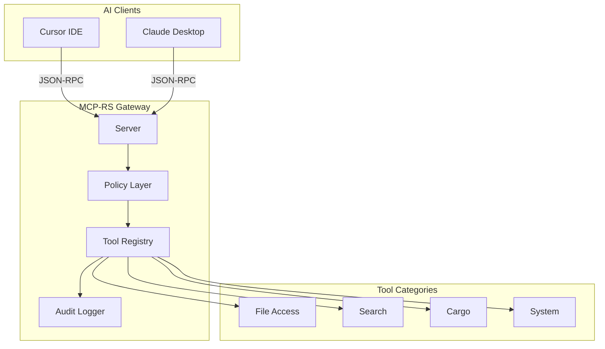

# **MCP-RS Enhancement Implementation Plan**

**Based on the analysis of [mcp-real-integrations.md](src/docs/ai/mcp-real-integrations.md) and the current codebase, this plan transforms MCP-RS into a production-grade AI execution gateway.**

---

## **Current State Assessment**

**Implemented: 14 tools across 5 categories (file access, search, cargo, system, utility)
Architecture: Synchronous JSON-RPC server with type-safe tool dispatch
Testing: 101 unit tests + integration test script**

**Key Gaps:**

- **No authorization/policy layer**
- **No logging or auditing**
- **Silent error handling with** `unwrap()` **calls**
- **No path traversal protection**
- **No file size limits**
- `thiserror` **dependency unused**

---

## **Phase 1: Foundation - Logging and Error Handling**

**Goal: Add observability and robust error handling before adding security features.**

### **1.1 Add Structured Logging**

**Add** `tracing` **and** `tracing-subscriber` **dependencies:**

```toml
tracing = "0.1"
tracing-subscriber = { version = "0.3", features = ["env-filter"] }
```

**Instrument key points:**

- **[src/server.rs](src/server.rs): Log all incoming requests and responses**
- **[src/registry.rs](src/registry.rs): Log tool calls with timing**

```rust
// Example logging pattern
tracing::info!(tool = %name, "TOOL_CALL");
tracing::debug!(args = ?args, "TOOL_ARGS");
```

### **1.2 Implement Structured Errors with thiserror**

**Create** `src/error.rs` **using the existing** `thiserror` **dependency:**

```rust
#[derive(Debug, thiserror::Error)]
pub enum McpError {
    #[error("Tool not found: {0}")]
    ToolNotFound(String),
    #[error("Invalid arguments: {0}")]
    InvalidArguments(String),
    #[error("Policy denied: {0}")]
    PolicyDenied(String),
    #[error("Execution error: {0}")]
    ExecutionError(String),
}
```

**Replace all** `unwrap()` **calls in [src/server.rs](src/server.rs) with proper error handling.**

### **1.3 Add Request Validation**

**Validate JSON-RPC structure before processing:**

- **Check required fields (**`jsonrpc`**,** `method`**,** `id` **for requests)**
- **Validate** `params` **structure for** `tools/call`
- **Return proper** `-32600` **(Invalid Request) errors**

---

## **Phase 2: Security - Policy Layer and Path Safety**

**Goal: Implement the "Command Firewall" pattern from the design document.**

### **2.1 Create Policy Module**

**Create** `src/policy.rs` **with authorization layer:**

```rust
pub struct Policy {
    pub allowed_paths: Vec<PathBuf>,
    pub denied_paths: Vec<PathBuf>,
    pub max_file_size: u64,
}

impl Policy {
    pub fn check(&self, tool: &str, args: &Value) -> Result<(), PolicyError>;
}
```

**Policy checks to implement:**

- **Path restrictions: Block access to** `/etc`**,** `/System`**, sensitive directories**
- **File size limits: Prevent reading files larger than configurable limit**
- **Command allowlists: Restrict which commands** `check_command` **can inspect**

### **2.2 Integrate Policy into Registry**

**Modify [src/registry.rs](src/registry.rs) to enforce policy before tool execution:**

```rust
pub fn call(&self, name: &str, args: Value) -> Result<Value, McpError> {
    self.policy.check(name, &args)?;  // Policy check first
    // ... existing execution logic
}
```

### **2.3 Add Path Traversal Protection**

**Enhance file-access tools with path canonicalization:**

- **[src/tools/file_read.rs](src/tools/file_read.rs)**
- **[src/tools/list_dir.rs](src/tools/list_dir.rs)**
- **[src/tools/grep.rs](src/tools/grep.rs)**
- **[src/tools/file_stats.rs](src/tools/file_stats.rs)**

```rust
fn validate_path(path: &str, policy: &Policy) -> Result<PathBuf, PolicyError> {
    let canonical = std::fs::canonicalize(path)?;
    if policy.is_path_allowed(&canonical) {
        Ok(canonical)
    } else {
        Err(PolicyError::AccessDenied(path.to_string()))
    }
}
```

---

## **Phase 3: Auditing - Full Tool Call Tracing**

**Goal: Enable replayable, auditable AI sessions.**

### **3.1 Create Audit Log Module**

**Create** `src/audit.rs` **for structured audit logging:**

```rust
#[derive(Serialize)]
pub struct AuditEntry {
    pub timestamp: String,
    pub request_id: Value,
    pub tool_name: String,
    pub arguments: Value,
    pub result: AuditResult,
    pub duration_ms: u64,
}

pub enum AuditResult {
    Success(Value),
    PolicyDenied(String),
    Error(String),
}
```

### **3.2 Add File-Based Audit Trail**

**Write audit entries to a configurable log file (JSON lines format):**

```rust
pub struct AuditLogger {
    file: BufWriter<File>,
}

impl AuditLogger {
    pub fn log(&mut self, entry: &AuditEntry) -> io::Result<()>;
}
```

### **3.3 Add Session Replay Capability**

**Support loading and replaying audit logs for testing/debugging:**

```rust
pub fn replay_session(log_path: &Path) -> Vec<AuditEntry>;
```

---

## **Phase 4: Advanced Patterns - Intent Declaration**

**Goal: Implement the "Intent Router" pattern for explicit AI action declaration.**

### **4.1 Create Intent Declaration Tool**

**Add** `src/tools/declare_intent.rs`**:**

```rust
pub struct DeclareIntent;

#[derive(Deserialize)]
pub struct Input {
    pub intent: String,           // What the AI wants to do
    pub justification: String,    // Why it needs to do this
    pub requested_tools: Vec<String>, // Tools it plans to use
}

#[derive(Serialize)]
pub struct Output {
    pub approved: bool,
    pub allowed_tools: Vec<String>,
    pub session_token: Option<String>, // Token for subsequent calls
    pub reason: Option<String>,
}
```

### **4.2 Add Intent-Based Access Control**

**Require intent declaration before sensitive tool categories:**

- **File write operations (future)**
- **External HTTP requests (future)**
- **Command execution (future)**

### **4.3 Intent Tracking in Audit Log**

**Link tool calls to declared intents in audit entries.**

---

## **Phase 5: Configuration and Runtime Control**

**Goal: Make MCP-RS configurable without recompilation.**

### **5.1 Add Configuration File Support**

**Create** `src/config.rs` **for TOML-based configuration:**

```toml
# mcp-rs.toml
[server]
log_level = "info"

[policy]
allowed_paths = [".", "/tmp"]
denied_paths = ["/etc", "/System"]
max_file_size_mb = 10

[audit]
enabled = true
log_path = "./mcp-audit.jsonl"
```

### **5.2 Add Runtime Policy Reload**

**Support hot-reloading policy without server restart (via signal or control tool).**

### **5.3 Add Health Check Tool**

**Create** `src/tools/health.rs` **for server status introspection:**

```rust
pub struct Output {
    pub status: String,
    pub uptime_seconds: u64,
    pub tools_registered: u32,
    pub requests_processed: u64,
    pub policy_version: String,
}
```

---

## **Phase 6: Performance - Async Execution (Optional)**

**Goal: Enable concurrent tool execution for performance.**

### **6.1 Migrate to Async Runtime**

**Add** `tokio` **dependency and convert to async:**

- **Async tool trait variant**
- **Concurrent request handling**
- **Timeout support for long-running tools**

### **6.2 Add Tool Timeout Configuration**

```toml
[tools.cargo_build]
timeout_seconds = 300

[tools.grep_project]
timeout_seconds = 30
```

---

## **Architecture Diagram**




---

## **Implementation Priority**


| **Phase**                 | **Effort** | **Impact**   | **Risk Reduction** |
| ------------------------- | ---------- | ------------ | ------------------ |
| **1. Logging/Errors**     | **Low**    | **High**     | **Medium**         |
| **2. Policy/Security**    | **Medium** | **Critical** | **High**           |
| **3. Auditing**           | **Medium** | **High**     | **High**           |
| **4. Intent Declaration** | **Medium** | **Medium**   | **Medium**         |
| **5. Configuration**      | **Low**    | **Medium**   | **Low**            |
| **6. Async (Optional)**   | **High**   | **Medium**   | **Low**            |


**Recommended order: Phase 1 -> Phase 2 -> Phase 3 -> Phase 5 -> Phase 4 -> Phase 6**

---

## **Files to Create/Modify**

**New Files:**

- `src/error.rs` **- Structured error types**
- `src/policy.rs` **- Authorization layer**
- `src/audit.rs` **- Audit logging**
- `src/config.rs` **- Configuration management**
- `src/tools/declare_intent.rs` **- Intent router tool**
- `src/tools/health.rs` **- Health check tool**
- `mcp-rs.toml` **- Default configuration**

**Modified Files:**

- **[Cargo.toml](Cargo.toml) - Add** `tracing`**,** `tracing-subscriber`
- **[src/main.rs](src/main.rs) - Initialize logging, load config**
- **[src/server.rs](src/server.rs) - Add logging, remove unwrap()**
- **[src/registry.rs](src/registry.rs) - Integrate policy layer**
- **All tools in** `src/tools/` **- Add path validation**

